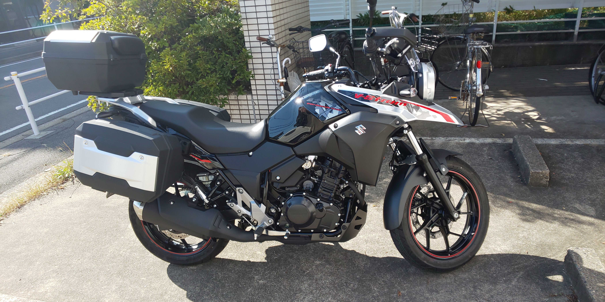

# Welcome to page of my works!!
<!-- test -->
Thank you for visiting and interest in my works. I introduce myself, works, projects or something I can contribute.
Please feel free to contact me.

## Contact

e-mail: sd19446\[at\]toyota-ti.ac.jp

## About Me

### Belongings

- Master student in Computer Science at [Toyota Technological Institute](https://www.toyota-ti.ac.jp/) in Japan
  - Lab : [Computational Intelligence Laboratory](https://tticoin.wordpress.com/)
- Research Assistant at [Panasonic-AIST Advanced AI Research Laboratory](https://unit.aist.go.jp/pana-aaicrl/) in [National Institute of Advanced Industrial Science and Technology](https://www.aist.go.jp/)

### My Interest

- Computer Science
- Natural Language Processing \(NLP\)
- Relation Extraction \(RE\)
- Information Extraction \(IE\)

### Hobby

- Motorcycle
  - V-strom 250 \(Suzuki\) 
- Liquor
- Bass guiter

## Publication List

- **牧野 晃平**，三輪 誠，新谷 浩平，阿部 充治，佐々木 裕，再帰ニューラルネットを用いた車両運動性の代理モデリング，日本機械学会論文集, 2020. (accepted)
  - en : Kohei MAKINO, Makoto MIWA, Kohei SHINTANI, Atsuji ABE and Yutaka SASAKI, Surrogate modeling of vehicle dynamics using Recurrent Neural Networks, Transactions of the Japan Society of Mechanical Engineers, 2020. (in Japanese) (accepted)

- **牧野 晃平**，國吉 房貴，小澤 順，三輪 誠，無機材料科学論文からの合成プロセスパラグラフ抽出，第34回人工知能学会全国大会，2020
  - [paper](https://www.jstage.jst.go.jp/article/pjsai/JSAI2020/0/JSAI2020_4Rin112/_article/-char/ja/)

- 國吉 房貴，**牧野 晃平**，小澤 順，三輪 誠，論文中に記載される合成プロセスの抽出手法の提案と全固体電池分野での評価，第34回人工知能学会全国大会，2020
  - [paper](https://www.jstage.jst.go.jp/article/pjsai/JSAI2020/0/JSAI2020_3Rin460/_article/-char/ja/)

- **牧野 晃平**，國吉 房貴，小澤 順，三輪 誠，無機材料文献からの合成プロセス抽出のための関係抽出，言語処理学会第26回年次大会，2020.

- Fusataka Kuniyoshi, **Kohei Makino**, Jun Ozawa, Makoto Miwa, Annotating and Extracting Synthesis Process of All-Solid-State Batteries from Scientific Literature, In Proceedings of The 12th Language Resources and Evaluation Conference, 2020.
  - [paper](https://www.aclweb.org/anthology/2020.lrec-1.239/)

- **牧野 晃平**，三輪 誠，新谷 浩平，阿部 充浩，佐々木裕，深層学習を用いた車両運動性能の代理モデルの開発，第29回設計工学・システム部門講演会，9月26日, 2019.

<!-- ### Works and Activities -->

