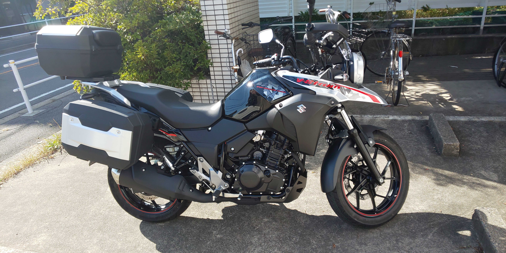

# Welcome to page of my work!!
Thank you for visiting and interest in my work. I introduce myself, work, projects or something I can contribute.
Please feel free to contact me.

## Contact

- e-mail: sd21505\[at\]toyota-ti.ac.jp
- [GitHub](https://github.com/bowdbeg)
- [LinkedIn](https://www.linkedin.com/in/kohei-makino/)
- [Google Scholar](https://scholar.google.com/citations?user=SVObobAAAAAJ)
- [twitter](https://twitter.com/KoheiMAKINO2)

## About Me

- Name: Kohei MAKINO \(牧野 晃平\)
- Gender: Male \(男\)
- Birth: Nov. 1996
- Address: Nagoya, Aich, Japan \(愛知県名古屋市\)
- Birthplace: Hokkaido, Japan \(北海道\)

### Experience

- Engineer
  - [一般社団法人ZIAI](https://ziai.jp/) \(2021/4-Present\)
- Research Assistant
  - [Panasonic-AIST Advanced AI Research Laboratory](https://unit.aist.go.jp/pana-aaicrl/) \(パナソニック-産総研先進型AI連携研究ラボ\) \(2019/9-2021/3\)
- Internship
  - [KYOHO MACHINE WORKS, LTD.](http://www.kyoho-ss.co.jp/) \(株式会社協豊製作所\) \(2018/2-2018/3\)
- Internship
  - [MIKASA SANGYO CO,.LTD](https://www.mikasas.com/) \(三笠産業株式会社\) \(2016/2-2016/3\)

### Education
- Ph.D. student at [Toyota Technological Institute in Japan (TTI)](https://www.toyota-ti.ac.jp/) \(豊田工業大学\) \(2021/4-Present\)
  - 豊田工業大学大学院 博士後期課程 工学研究科 情報援用工学専攻
  - Lab : [Computational Intelligence Laboratory](https://tticoin.wordpress.com/) \(知能数理研究室\)
- Master of engineering at TTI \(工学修士\) (2019/4-2021/3)
  - 豊田工業大学大学院 博士前期課程 工学研究科 先端工学専攻
- Bachelor of engineering at TTI \(工学学士\) (2015/4-2019/3)
  - 豊田工業大学 工学部 先端工学基礎学科
- High school \(2012/4-2015/3\)
  - 北海道帯広柏葉高等学校 普通科

### Research Topics

- Computer Science \(CS\)
- Natural Language Processing \(NLP\)
  - Relation Extraction \(RE\)
  - Information Extraction \(IE\)

### Hobbies

- Motorcycle
  - V-strom 250 \(Suzuki\) 
  - I like to go camping with my motorcycle.
    
  - If you are interested in touring on a motorcycle with me, please contact me.
- Liquor
  - Whisky
  - Wine
  - Shochu
- Bass guitar

## Publication List

### International conferences
- **Kohei Makino**, Makoto Miwa, Yutaka Sasaki. A Neural Edge-Editing Approach for Document-Level Relation Graph Extraction. In Proceedings of the Findings of the Association for Computational Linguistics: ACL2021. 2021. [\[arXiv\]](https://arxiv.org/abs/2106.09900) [\[code\]](https://github.com/tti-coin/edge-editing) [\[paper\]](https://aclanthology.org/2021.findings-acl.234/)
- Fusataka Kuniyoshi, **Kohei Makino**, Jun Ozawa, Makoto Miwa. Annotating and Extracting Synthesis Process of All-Solid-State Batteries from Scientific Literature. In Proceedings of The 12th Language Resources and Evaluation Conference. 2020. [\[paper\]](https://www.aclweb.org/anthology/2020.lrec-1.239/)

### Journal papers
- **牧野 晃平**，三輪 誠，新谷 浩平，阿部 充治，佐々木 裕．再帰ニューラルネットを用いた車両運動性の代理モデリング．日本機械学会論文集．2020. [\[paper\]](https://www.jstage.jst.go.jp/article/transjsme/86/891/86_20-00177/_article/-char/ja)
  - en : Kohei MAKINO, Makoto MIWA, Kohei SHINTANI, Atsuji ABE and Yutaka SASAKI. Surrogate modeling of vehicle dynamics using Recurrent Neural Networks. Transactions of the Japan Society of Mechanical Engineers. 2020. (in Japanese) [\[paper\]](https://www.jstage.jst.go.jp/article/transjsme/86/891/86_20-00177/_article/)

### Domestic conferences
- **牧野 晃平**，三輪 誠，佐々木 裕．文書単位関係グラフ抽出のための反復的な辺編集と編集履歴の利用．NLP若手の会 (YANS) 第16回シンポジウム．2021．
- **牧野 晃平**，三輪 誠，佐々木 裕．辺編集による文書レベルの関係グラフ構築．言語処理学会第27回年次大会（NLP2021）．2021．[\[paper\]](https://www.anlp.jp/proceedings/annual_meeting/2021/pdf_dir/C8-3.pdf)
- **牧野 晃平**，國吉 房貴，小澤 順，三輪 誠．無機材料科学論文からの合成プロセスパラグラフ抽出．第34回人工知能学会全国大会．2020 [\[paper\]](https://www.jstage.jst.go.jp/article/pjsai/JSAI2020/0/JSAI2020_4Rin112/_article/-char/ja/)
- 國吉 房貴，**牧野 晃平**，小澤 順，三輪 誠．論文中に記載される合成プロセスの抽出手法の提案と全固体電池分野での評価．第34回人工知能学会全国大会．2020 [\[paper\]](https://www.jstage.jst.go.jp/article/pjsai/JSAI2020/0/JSAI2020_3Rin460/_article/-char/ja/)
- **牧野 晃平**，國吉 房貴，小澤 順，三輪 誠．無機材料文献からの合成プロセス抽出のための関係抽出．言語処理学会第26回年次大会．2020. [\[paper\]](https://www.anlp.jp/proceedings/annual_meeting/2020/pdf_dir/G4-2.pdf)
- **牧野 晃平**，三輪 誠，新谷 浩平，阿部 充浩，佐々木裕．深層学習を用いた車両運動性能の代理モデルの開発．第29回設計工学・システム部門講演会．9月26日, 2019. [\[paper\]](https://www.jstage.jst.go.jp/article/jsmedsd/2019.29/0/2019.29_2209/_article/-char/ja/)

## Patent
- 新谷浩平，佐々木裕，三輪誠，**牧野晃平**．車体性能予測方法．特開2021-022310．2021年2月18日 [\[URL\]](https://www.j-platpat.inpit.go.jp/c1800/PU/JP-2021-022310/07D921FDC07CC9425F69C65F313B150DAC32E78436EEAF604240E7923777C606/11/ja)

## Awards
- スポンサー賞 Sansan DSOC賞 @ 言語処理学会第27回年次大会（NLP2021）[\[URL\]](https://www.anlp.jp/nlp2021/award.html)
