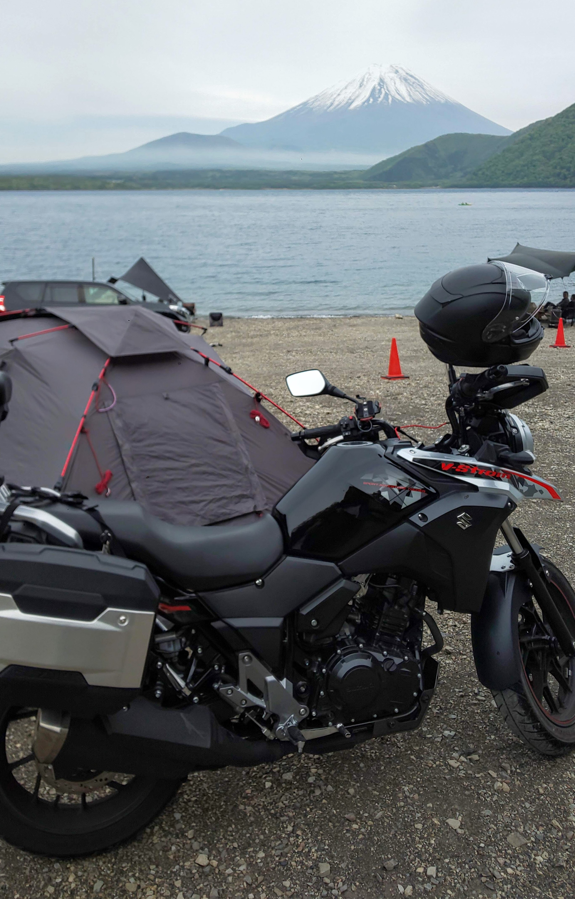

# Welcome to page of my work!!
Thank you for visiting and interest in my work. I introduce myself, work, projects or something I can contribute.
Please feel free to contact me.

## Contact

- e-mail: sd21505\[at\]toyota-ti.ac.jp
- [GitHub](https://github.com/bowdbeg)
- [LinkedIn](https://www.linkedin.com/in/kohei-makino/)
- [Google Scholar](https://scholar.google.com/citations?user=SVObobAAAAAJ)
- [twitter](https://twitter.com/KoheiMAKINO2)

## About Me

- Name: Kohei MAKINO \(牧野 晃平\)
- Gender: Male \(男\)
- Birth: Nov. 1996
- Address: Nagoya, Aich, Japan \(愛知県名古屋市\)
- Birthplace: Hokkaido, Japan \(北海道\)

### Experience
- JSPS DC2 Research Fellow
  - 日本学術振興会特別研究員 DC2 \(2022/4-2024/3\)
- Engineer
  - [一般社団法人ZIAI](https://ziai.jp/) \(2021/4-2023/6\)
- Research Assistant
  - [Panasonic-AIST Advanced AI Research Laboratory](https://unit.aist.go.jp/pana-aaicrl/) at [National Institute of Advanced Industrial Science and Technology (AIST)](https://www.aist.go.jp/) \(国立研究開発法人産業技術総合研究所 パナソニック-産総研先進型AI連携研究ラボ\) \(2019/9-2021/3\)
- Internship
  - [KYOHO MACHINE WORKS, LTD.](http://www.kyoho-ss.co.jp/) \(株式会社協豊製作所\) \(2018/2-2018/3\)
- Internship
  - [MIKASA SANGYO CO,.LTD](https://www.mikasas.com/) \(三笠産業株式会社\) \(2016/2-2016/3\)

### Education
- Ph.D. student at [Toyota Technological Institute in Japan (TTI)](https://www.toyota-ti.ac.jp/) \(豊田工業大学\) \(2021/4-Present\)
  - 豊田工業大学大学院 博士後期課程 工学研究科 情報援用工学専攻
  - Lab : [Computational Intelligence Laboratory](https://tticoin.wordpress.com/) \(知能数理研究室\)
- Master of engineering at TTI \(工学修士\) (2019/4-2021/3)
  - 豊田工業大学大学院 博士前期課程 工学研究科 先端工学専攻
- Bachelor of engineering at TTI \(工学学士\) (2015/4-2019/3)
  - 豊田工業大学 工学部 先端工学基礎学科
- High school \(2012/4-2015/3\)
  - 北海道帯広柏葉高等学校 普通科

### Research Topics

- Computer Science \(CS\)
- Natural Language Processing \(NLP\)
  - Relation Extraction \(RE\)
  - Information Extraction \(IE\)

### Hobbies

- Motorcycle
  - V-strom 250 \(Suzuki\) 
  - I like to go camping with my motorcycle.
    
  - If you are interested in touring on a motorcycle with me, please contact me.
- Liquor
  - Whisky
  - Wine
  - Shochu
- Bass guitar

## Publication List

### Journal papers
- Kasumi Ohno, **Kohei Makino**, Makoto Miwa, Yutaka Sasaki. Long-Term, Multivariate Time Series Generation With the Capture of Intervariate Correlations and Variatewise Characteristics. In IEEE Access. vol. 13, pp. 130747-130757. 2025.[\[paper\]](https://doi.org/10.1109/ACCESS.2025.3590728)
- **牧野 晃平**, 三輪 誠, 佐々木 裕. 文書単位関係抽出における抽出済みの関係候補を辺とした関係グラフの辺編集. 自然言語処理 30 巻, 2号, pp. 557-585. 2023. [\[paper\]](https://doi.org/10.5715/jnlp.30.557)
- **Kohei Makino**, Fusataka Kuniyoshi, Jun Ozawa, and Makoto Miwa. Extracting and Analyzing Inorganic Material Synthesis Procedures in the Literature. In IEEE Access. vol. 10, pp. 31524-31537. 2022. [\[paper\]](https://doi.org/10.1109/ACCESS.2022.3160201)
- **牧野 晃平**, 三輪 誠, 新谷 浩平, 阿部 充治, 佐々木 裕. 再帰ニューラルネットを用いた車両運動性の代理モデリング. 日本機械学会論文集. 86 巻, 891 号, p. 20-00177. 2020. [\[paper\]](https://www.jstage.jst.go.jp/article/transjsme/86/891/86_20-00177/_article/-char/ja)

### International conferences and Workshops (Peer-reviewed)
- **Kohei Makino**, Makoto Miwa, and Yutaka Sasaki. A Neural Edge-Editing Approach for Document-Level Relation Graph Extraction. In Proceedings of the Findings of the Association for Computational Linguistics: ACL2021. 2021. [\[arXiv\]](https://arxiv.org/abs/2106.09900) [\[code\]](https://github.com/tti-coin/edge-editing) [\[paper\]](https://aclanthology.org/2021.findings-acl.234/)
- Fusataka Kuniyoshi, **Kohei Makino**, Jun Ozawa, and Makoto Miwa. Annotating and Extracting Synthesis Process of All-Solid-State Batteries from Scientific Literature. In Proceedings of The 12th Language Resources and Evaluation Conference. 2020. [\[paper\]](https://www.aclweb.org/anthology/2020.lrec-1.239/)

### International conferences and Workshops (Non Peer-reviewed)
- Koki Ueno, **Kohei Makino**, Yutaka Sasaki. Empirically Estimated Uncertainty-Guided Iterative Decoding Strategy of Diffusion Models for Time Series Forecasting. In Proc. of AI4TS: AI for Time Series Analysis. 2025. [\[paper\]](https://github.com/AI4TS/AI4TS.github.io/blob/main/Camera_ready_IJCAI2025/3.IJCAI2025_WorkShop.pdf)
- Kasumi Ohno, **Kohei Makino**, Makoto Miwa, Yutaka Sasaki. Long-Term Multivariate Time Series Generation with the Capture of Intervariate Dependencies and Variatewise Characteristics. In Proc. of AI4TS: AI for Time Series Analysis. 2025. [\[paper\]](https://github.com/AI4TS/AI4TS.github.io/blob/main/Camera_ready_IJCAI2025/9.IJCAI2025_AI4TS_v2.pdf)
- **Kohei Makino**, Makoto Miwa, and Yutaka Sasaki. Referring to Training Examples from Each Transformer Layer for Relation Extraction. In Proc. of Seventh International Workshop on Symbolic-Neural Learning (SNL2023). 2023. [\[URL\]](https://liat-aip.sakura.ne.jp/snl2023/program.html)
- Kasumi Ohno, **Kohei Makino**, Makoto Miwa, and Yutaka Sasaki. Synthetic Data Augmentation for Time Series Forecasting. In Proc. of Women in Machine Learning (WiML) Workshop 2022. Dec 2022. [\[URL\]](https://sites.google.com/view/wiml2022/program)
- Koshi Yamada, Ryuki Ida, Tomoki Tsujimura, **Kohei Makino**, Makoto Miwa, and Yutaka Sasaki. Span-based and Question Answering-based Medication Event Extraction. In Proc. of 2022 n2c2 Shared Task and Workshop. Nov 2022. [\[URL\]](https://n2c2.dbmi.hms.harvard.edu/2022-amia-workshop)

### Domestic conferences and Workshops (Non Peer-reviewed)
- 大野 花純, **牧野 晃平**, 三輪 誠, 佐々木 裕. 高品質な時系列生成による長期時系列予測のためのデータ拡張. 第38回人工知能学会全国大会. 2024. [\[paper\]](https://doi.org/10.11517/pjsai.JSAI2024.0_4Xin263)
- **牧野 晃平**, 三輪 誠, 佐々木 裕. 訓練可能なk近傍Retrieverで関係抽出事例を導入したニューラルプロンプティング. 言語処理学会第30回年次大会（NLP2024）. 2024. [\[paper\]](https://www.anlp.jp/proceedings/annual_meeting/2024/pdf_dir/P10-10.pdf)
- 鬼頭 泰清, **牧野 晃平**, 三輪 誠, 佐々木 裕. 固有表現抽出における大規模言語モデルのLoRAファインチューニングの学習設定の調査. 言語処理学会第30回年次大会（NLP2024）. 2024. [\[paper\]](https://www.anlp.jp/proceedings/annual_meeting/2024/pdf_dir/A3-5.pdf)
- 吉村 貴紀, **牧野 晃平**, 三輪 誠, 佐々木 裕. 表層が同じ文字列の同一性を表現した深層固有表現抽出. 言語処理学会第30回年次大会（NLP2024）. 2024. [\[paper\]](https://www.anlp.jp/proceedings/annual_meeting/2024/pdf_dir/P10-24.pdf)
- **牧野 晃平**, 三輪 誠, 佐々木 裕. コーパス内の関係間の相互作用を考慮した関係抽出. NLP若手の会 (YANS) 第18回シンポジウム. 2023. [\[URL\]](https://yans.anlp.jp/entry/yans2023program)
- **牧野 晃平**. 画像中バウンディングボックス内における拡散過程のためのゲート付きノイズ除去拡散確率モデル. 第37回人工知能学会全国大会. 2023. [\[paper\]](https://doi.org/10.11517/pjsai.JSAI2023.0_3Xin434)
- 柳井 佑太, 牧野 晃平, 川西 通裕. 特徴量空間上のベクトルに対するノイズ除去拡散確率モデルによる画像分類. 第37回人工知能学会全国大会. 2023. [\[paper\]](https://doi.org/10.11517/pjsai.JSAI2023.0_4Xin132)
- 大野 花純, **牧野 晃平**, 三輪 誠, 佐々木 裕. 時系列予測における人工データを用いたデータ拡張. 第37回人工知能学会全国大会. 2023. [\[paper\]](https://doi.org/10.11517/pjsai.JSAI2023.0_4E2GS204)
- **牧野 晃平**, 二瀬 颯斗, 石崎 優人, 櫻井 昌佳. チャット形式心理カウンセリングにおける応答率向上のための補助システム開発に向けて. 第36回人工知能学会全国大会. 2022. [\[Paper\]](https://doi.org/10.11517/pjsai.JSAI2022.0_3Yin246)
- **牧野 晃平**, 三輪 誠, 佐々木 裕. 関係間の関係性を考慮した時間関係グラフ改善のためのグローバル反復辺編集器. 言語処理学会第28回年次大会（NLP2022）. 2022. [\[Paper\]](https://www.anlp.jp/proceedings/annual_meeting/2022/pdf_dir/C4-4.pdf)
- 二瀬 颯斗, **牧野 晃平**, 石崎 優人, 櫻井 昌佳. 自殺念慮防止のための心理カウンセリング補助システム開発に向けた対話データの作成と前処理. 言語処理学会第28回年次大会（NLP2022）. 2022. [\[Paper\]](https://www.anlp.jp/proceedings/annual_meeting/2022/pdf_dir/PT2-15.pdf)
- **牧野 晃平**, 國吉 房貴, 小澤 順, 三輪 誠. 無機材料科学分野における合成手順が記載された文献からの目的材料名称の抽出. 第35回人工知能学会全国大会. 2021. [\[Paper\]](https://doi.org/10.11517/pjsai.JSAI2021.0_2Xin516)
- **牧野 晃平**, 三輪 誠, 佐々木 裕. 文書単位関係グラフ抽出のための反復的な辺編集と編集履歴の利用. NLP若手の会 (YANS) 第16回シンポジウム. 2021.  [\[URL\]](https://yans.anlp.jp/entry/yans2021program)
- **牧野 晃平**, 三輪 誠, 佐々木 裕. 辺編集による文書レベルの関係グラフ構築. 言語処理学会第27回年次大会（NLP2021）. 2021. [\[Paper\]](https://www.anlp.jp/proceedings/annual_meeting/2021/pdf_dir/C8-3.pdf)
- **牧野 晃平**, 國吉 房貴, 小澤 順, 三輪 誠. 無機材料科学論文からの合成プロセスパラグラフ抽出. 第34回人工知能学会全国大会. 2020.  [\[Paper\]](https://doi.org/10.11517/pjsai.JSAI2020.0_4Rin112)
- 國吉 房貴, **牧野 晃平**, 小澤 順, 三輪 誠. 論文中に記載される合成プロセスの抽出手法の提案と全固体電池分野での評価. 第34回人工知能学会全国大会. 2020.  [\[Paper\]](https://doi.org/10.11517/pjsai.JSAI2020.0_3Rin460)
- **牧野 晃平**, 國吉 房貴, 小澤 順, 三輪 誠. 無機材料文献からの合成プロセス抽出のための関係抽出. 言語処理学会第26回年次大会. 2020.  [\[Paper\]](https://www.anlp.jp/proceedings/annual_meeting/2020/pdf_dir/G4-2.pdf)
- **牧野 晃平**, 三輪 誠, 新谷 浩平, 阿部 充浩, 佐々木裕. 深層学習を用いた車両運動性能の代理モデルの開発. 第29回設計工学・システム部門講演会. 9月26日, 2019.  [\[Paper\]](https://doi.org/10.1299/jsmedsd.2019.29.2209)

## Patents
- 新谷浩平, 佐々木裕, 三輪誠, **牧野晃平**. 車体性能予測方法. 特許7152367. 2022年.  [\[URL\]](https://www.j-platpat.inpit.go.jp/c1800/PU/JP-2021-022310/07D921FDC07CC9425F69C65F313B150DAC32E78436EEAF604240E7923777C606/11/ja)
- Kohei Shintani, Yutaka Sasaki, Makoto Miwa, and **Kohei Makino**. U.S. Patent Application No. 17/403,499. 2022. [\[URL\]](https://patents.google.com/patent/US20220050944A1/en)

## Awards
- 若手奨励賞 @ 言語処理学会第30回年次大会（NLP2024）[\[URL\]](https://www.anlp.jp/nlp2024/award.html)
- スポンサー賞 Sansan DSOC賞 @ 言語処理学会第27回年次大会（NLP2021）[\[URL\]](https://www.anlp.jp/nlp2021/award.html)
